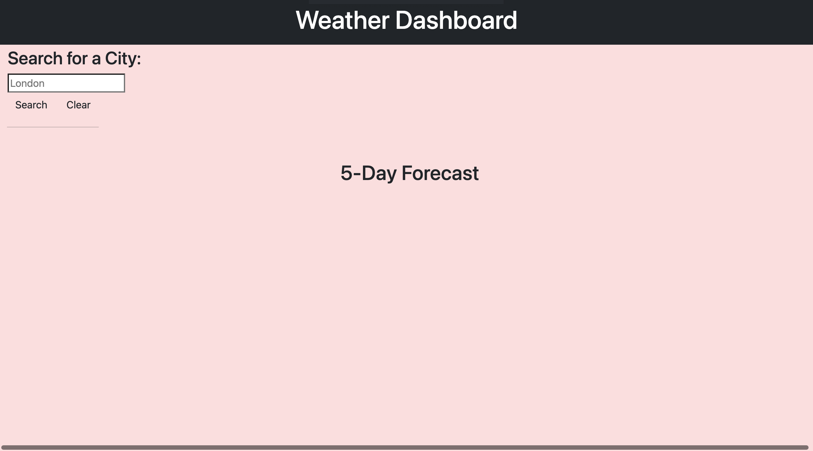
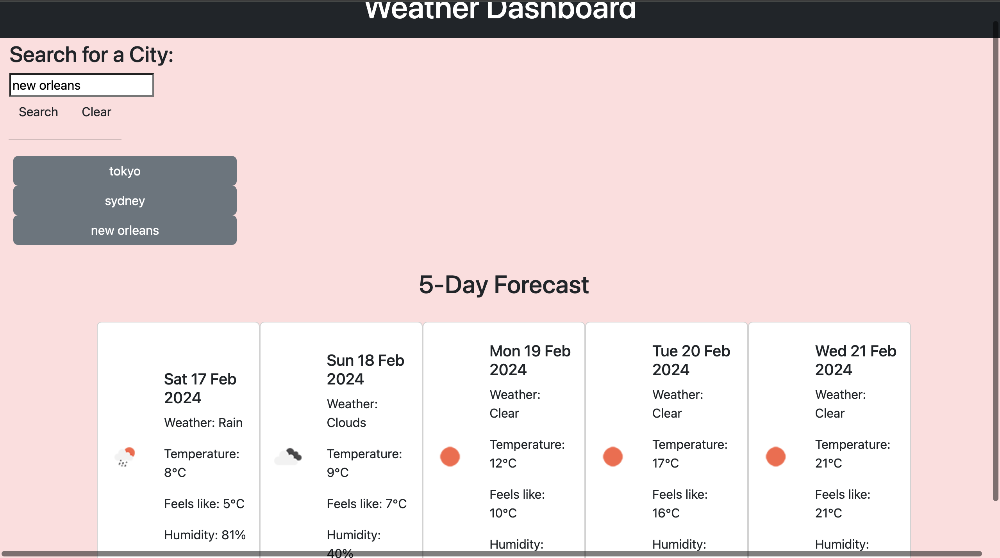

# Weather-app

## Table of Contents: 
* [Installation](#installation)
* [Usage](#usage)
* [Credits](#credits)
* [License](#license)

Installation: 

Similar to the original Portfolio taks, the steps to creating the work space remain the same.

Step 1: Creating a Repo. 

// Since the HTML and CSS files were already provided, the first step was creating a repo and duclicating the provided pages into the new Repo. 

// Once the repo was created cloning the repo on the terminal using "git clone "<SSH link>"

Step 2: creting the folders and files for the repo:

// for this task, the HTML and CSS file was provided already, the focus of the task was to use Javacript to scrape through a openWeatherAPi for forecast data and display that on a web page. this was done using a number of functions, one to search the data for the longitude and the latitude of the searched city and another function to pull the forecast data. In addition to this, one more function was used to save the search and append it onto the page as a button.

Step 3: Dynamically appending the weather cards to the HTML 

// Once the data was pulled from the API, I logged the data in the console log to decipher which information was needed to complete the task. Once the appropriate data was collected, another function was used to splice the data, sleelcting only the next 5 days of forecast and the data was appended onto the HTML using bootstrap cards.

Step 4: Event Listeners

// once all of the functions were created, event listeners were created to execute the functions when the respective buttons were pressed, completing the functionality of the web page.

Step 5: CSS stying and fixing errors

// Since the CSS file was provided, minor tweaks were made to display the cards in a more user friendly manner.

Final Product: 

Usage: 

// The page can be used to search the 5 day weather forecast for any city in the world, this can be used either to plan the user's week in their local area or plan for a quick trip to a foreign city.

Credits: 

    Repo is made by myself, the HTML and CSS were provided, minor tweaks made to both. The script.js was completed using the API documentation, MDN documentation and support of the teaching assistants.

License:

    See License in Repo

Deployed link: https://ohhmydeezy.github.io/Weather-app/